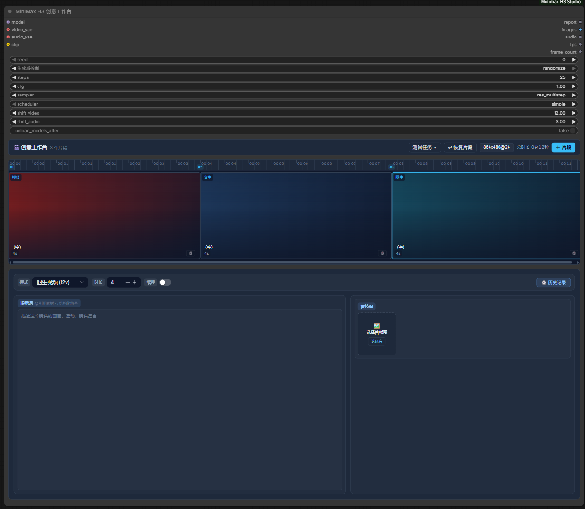
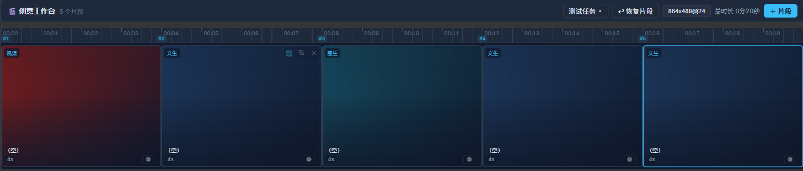
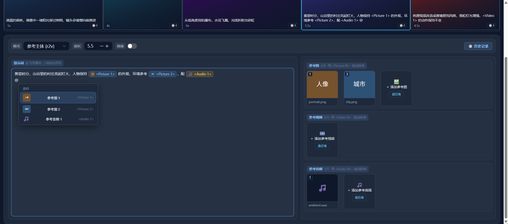
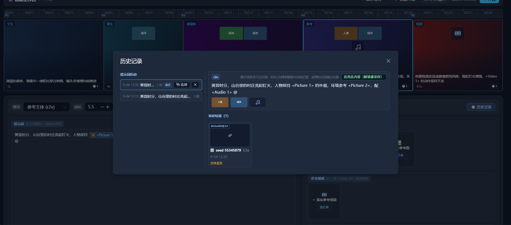
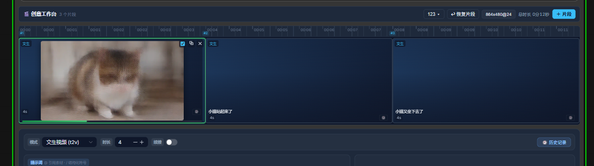

# ComfyUI-MiniMaxH3-Studio · MiniMax H3 创意工作台

> 在 ComfyUI 里像用剪辑软件一样，**编排并生成一条多镜头的 MiniMax H3 音视频成片**。
> 时间线规划分镜 → 逐镜配置模式/素材/提示词 → 统一 Queue 采样 → 自动按顺序拼接输出。

一个自定义节点，把视频生成的"分镜计划 → 采样 → 合成"全部收敛进一个可编辑的时间线面板，而不是在节点图里一条条接线、一次次跑。

> **定位：生成工具，不是剪辑工具。** 时间轴上是"要生成什么"的计划；最终输出**一条**按顺序拼接的完整成片（帧序列 + 音轨）。成品精剪/去重请交给剪辑软件。

---

## 它能帮你做什么

不用在节点图里接一大堆线、一段一段手动跑。**打开一个节点，像剪片一样把想生成的镜头排好，一键出整条视频。**

- 🎬 **一条时间线排完整支视频**
  把每一段要生成的画面按顺序排好：每段都能单独选生成方式、写提示词、放参考图/视频、调时长、决定要不要参与生成。镜头顺序想改就拖，时间线能缩放、能平移浏览。

- 🎞️ **支持多种生成方式，混着用**
  从文字生成、从一张图生成、给首尾两帧生成中间过程、用参考图/参考视频/参考音频锁定主体、把一段已有视频"翻译"成另一种风格…… 不同的镜头可以在同一条时间线里自由混排。

- 📚 **一个"项目"管理所有镜头**
  每次创作存成一个可命名的项目，随时打开继续做。项目之间可以复制（拿到一个干净的副本）、也可以导出给别人 / 从别人导入。**中途关了也不怕，内容会自动保存，下次打开接着排。**

- ⏪ **做错了能"翻旧账"**
  - *想退回之前的方案*：每次改提示词/素材都会留下记录，可以随时切回旧版本重新生成。
  - *同一段想多抽几个结果挑一挑*：同一设置多跑几次会留多份结果，看中哪个就用哪个，不用整段重来。

- 🎞️ **换画面时前后镜头更连贯**
  相邻镜头开启"续接"后，下一段会自动接着上一段结尾的画面/声音继续，衔接更自然。

- ⏩ **相同的活不重复干（省时间）**
  内容和设置都没变的那一段，再跑会直接复用之前的结果，跳过重复生成。

- 🖼️ **生成过程能实时看**
  鼠标放在正在采样的卡片上，画面会实时刷在片段卡片上，跑完也留有预览，方便边看边调。（可选装上一个小模型，预览效果更好；没装也不影响出片。）

- ✍️ **写提示词更省事**
  输入 `@` 直接引用已上传的素材（自动生成 `<Picture 1>` 这类占位、带缩略图）；输入 `/` 快速补全镜头/机位/说话者等专业写法，不用背格式。

- 🧩 **默认采样之外，还能换一套「采样流程」（进阶）**
  默认走官方采样链、不用管；想上二采高清放大或社区分享的采样方案，可以给片段挂一份自定义采样流程（在 ComfyUI 原生子图编辑器里搭），片段级替换、互不影响。仓库内置「二采1.0」示例可直接导入。

- 📦 **采样流程是全局资产，能复用与分享**
  自定义采样流程存在全局流程库（跨任务共享），可新建/编辑/复制/删除/导入导出，一份流程能同时挂在多张卡片上，也可以一键应用给全部片段。

- 💾 **换设备不丢活**
  数据库存储任务信息，重开 ComfyUI 或换工作流都能一键恢复，更换设备时也可导入导出。

---

## 界面一览


| 截图 | 内容 |
|---|---|
|  | **01-overview.png** — 节点内创意工作台全景（任务库 + 时间线 + 片段详情面板） |
|  | **02-timeline.png** — 时间线多模式片段、拖拽排序 / 缩放浏览 |
|  | **03-prompt-editor.png** — 提示词 `@` 素材引用 chip 与 `/` 结构化补全 |
|  | **04-history.png** — 历史区：卡片级版本 + 抽卡级 latent 切换 / 锁定 |
|  | **05-sampling.png** — 采样中 live 预览帧 + 进度条 / 大预览弹窗 |

---

## 安装

> 仓库**只提交源码，不含前端构建产物**（`web/dist/`，ComfyUI 运行时加载的是构建后的前端）。两种方式任选，**普通用户用方式 A**。
>
> 两种方式都**不需要额外 pip 依赖**：视频/音频解码走 ComfyUI 自带的 PyAV（`av`），解压 / 构建完直接重启即可。

### 方式 A：Release 安装（推荐，免构建）

下载最新版 [Releases](https://github.com/mangranzhiairen/ComfyUI-Minimax-H3-Studio/releases) 构件 zip（已含前端），解压到 `ComfyUI/custom_nodes/`：

```bash
unzip ComfyUI-MiniMaxH3-Studio_v*.zip -d <ComfyUI>/custom_nodes/
```

### 方式 B：源码克隆 + 构建

```bash
# 1. 克隆到 custom_nodes/
git clone https://github.com/mangranzhiairen/ComfyUI-Minimax-H3-Studio.git
cd ComfyUI-Minimax-H3-Studio

# 2. 构建前端（产出 web/dist）
cd web && npm install && npm run build && cd ..
```

### 安装后的共同步骤

1. **模型与官方组件**：需要 ComfyUI 内置的 MiniMax H3 组件（随 ComfyUI 自带）与对应模型（UNET / video VAE / audio VAE / minimax CLIP）。
2. **（可选）采样实时预览**：将 `taeh3.safetensors` 放入 `ComfyUI/models/vae_approx/`；缺失时预览自动降级，不影响出片。
3. **重启 ComfyUI**，在节点菜单 **MiniMaxH3** 分类找到 **MiniMax H3 创意工作台**。

---

## 使用

1. **添加节点** — 在 **MiniMaxH3** 分类添加 **MiniMax H3 Studio**（节点类 `MiniMaxH3StudioConsole`）
2. **建任务、排时间线** — 在节点面板里新建一个任务 → 「＋ 片段」添加镜头 → 逐段选模式、放素材、写提示词、调时长与是否启用。时间线会自动覆盖式保存到任务库。
3. **调采样参数并生成** — 全局采样参数（seed / steps / cfg / sampler / scheduler / shift_video / shift_audio / unload_models_after）是节点原生 widget，调好后点 **Queue**。
4. **取结果** — 输出：`report`（每段执行摘要）、`images`（全部段拼接的帧序列）、`audio`（拼接音轨）、`fps`、`frame_count`；可接 `VHS_VideoCombine` 等导出成片。

> **提示**：采样参数（seed 等）随样本记录；**修改时间线内容（提示词/素材）后旧 latent 缓存自动失效**，Queue 时按当前内容重新采样。

### 自定义采样流程（可选 · 进阶）

默认不需要碰。想让某个镜头用不同的采样工艺（例如「二采高清放大」）：

1. 工具栏打开「采样流程库」→ 新建一份流程，会在 **ComfyUI 原生子图编辑器**中打开，里面预置了 6 个输入槽（conditioning / latent / noise / model / sampler / scheduler）和一个输出槽（latent）。
2. 从这些槽拉线搭自己的采样链，保存后自动回写流程库。
3. 在片段卡片的「⊞ 采样流程」下拉里选中它（或「应用到全部」）；不选 = 官方流程。
4. 导入 / 导出：流程以 `.studio-pipeline.json` 单文件分享；仓库内置示例 [`example_sample_workflow/二采1.0.studio-pipeline.json`](example_sample_workflow/二采1.0.studio-pipeline.json)。

已知限制：平铺图内暂不支持嵌套子图与异步节点；节点类缺失或漏接线会给出可读报错。设计细节见[自定义采样流程设计](doc/custom-sampling-plan.md)与[后端模块文档](doc/backend-modules.md)。

---

## 开发者

项目是前后端同仓的一个 ComfyUI 自定义节点。

### 目录结构

```
├── VERSION                  # 版本号单一来源（后端/前端/打包都从它派生）
├── __init__.py              # 节点注册 + WEB_DIRECTORY(web/dist) + HTTP 路由
├── nodes/studio_console.py  # 创意工作台节点（INPUT_TYPES + execute）
├── studio/                  # 后端：执行器 / 任务 / 采样 / 数据层 / 路由 / 预览
├── web/                     # 前端：Vue 3 + TS + Vite + Naive UI + Pinia
├── doc/                     # 模块级文档（后端 / 前端 / 自定义采样流程设计）
├── example_sample_workflow/ # 示例采样流程（.studio-pipeline.json，可导入流程库）
├── scripts/build_plugin.{bat,sh}  # 一键打包脚本（Windows / Linux·macOS）
├── scripts/bump_version.py  # 升版本（只写 VERSION，唯一来源）
├── scripts/check_version.py # 版本一致性校验（发版门禁）
├── tests/test_studio.py     # 后端单测（无需 ComfyUI 环境）
├── tests/test_pipeline.py   # 采样流程执行器单测
└── assets/screenshots/      # README 功能截图
```

模块级说明见 [`doc/`](doc/)：[后端](doc/backend-modules.md) · [前端](doc/frontend-modules.md) · [自定义采样流程](doc/custom-sampling-plan.md)。

### 版本号管理

版本号**只在仓库根 `VERSION` 文件里手写一次**，其余全部派生：

| 消费方 | 何时读 | 怎么读 |
|---|---|---|
| 后端 `/minimax/studio/version` | 运行时 | `studio/version.py` 读 VERSION（随 Release 包分发） |
| 前端 `__STUDIO_VERSION__` | 构建时 | `web/vite.config.ts` 读 VERSION 注入 |
| dev 预览 mock | dev server | 由 `web/vite.config.ts` 传参注入（mockPlugin 不自读） |
| Release zip 命名 | 打包时 | `scripts/build_plugin.*` 读 VERSION |
| `web/package.json` | npm 运行所需 | **不声明 version**（唯一来源只有 VERSION） |

> 不要用 `npm version` / `npm pkg set version` —— 那会给 package.json 加回 version
> 字段，等于又造出第二个需要手改的版本号。升版本一律走 `bump_version.py`（只写 `VERSION`）。

### 发版流程

```bash
python scripts/bump_version.py 0.1.2    # 1. 升版本（只写 VERSION + 自校验）
scripts\build_plugin.bat                # 2. 构建前端 + 打包（版本读 VERSION；打包前校验 dist 内嵌版本）
python scripts/check_version.py         # 3. 发布门禁：必须全部 [OK] 才传 Release
```

第 2 步本身也会在打包前校验 `web/dist` 内嵌的 `__STUDIO_VERSION__` 与 `VERSION` 一致，
不一致直接失败 —— 即使 `--no-build` 复用旧产物也发不出错包。
第 3 步进一步挡住「改了版本号但没重新构建前端」以及 npm 侧重新声明 version 的情况 ——
那会让包里的前后端版本不一致，
而这个版本自检正是防「浏览器缓存旧 JS 把空时间线写进工作流 json」的数据保护
（详见[前端模块文档](doc/frontend-modules.md)），漂移等于保护失效。

### 清理过期构建产物

`dist_package/` 会累积每次打包的 zip（已 gitignore），传 Release 前确认拿的是最新那个；
历史包建议随手删掉，避免误传。

### 本地开发

```bash
# 前端（web/ 下）
npm install
npm run dev              # 浏览器独立预览（内置 dev mock，可全量验证前端交互）
npm run build            # 构建 ComfyUI 集成产物 → web/dist/minimax-h3-studio.js
npx vue-tsc --noEmit     # TS 类型检查

# 后端（项目根，使用 ComfyUI venv）
python tests/test_studio.py
python tests/test_pipeline.py
```

打包发布 zip（构建前端 + 收集运行时文件）：

```bash
scripts\build_plugin.bat       # Windows
bash scripts/build_plugin.sh   # Linux / macOS
# 加 --no-build 跳过前端构建，复用已有 web/dist
```

**约定**：Python 端改动需重启 ComfyUI；前端 JS 改动浏览器硬刷新（Ctrl+Shift+R）。

---

## 数据与缓存

- **任务元数据**：`ComfyUI/user/ComfyUI-MiniMaxH3-Studio/tasks.db`（SQLite：tasks / clip_versions / version_samples；另有全局 **pipeline_library** 采样流程库，跨任务共享）
- **latent 缓存**：`ComfyUI/output/minimax_h3_studio/{node_id}/latent_{sample_fp}.pt`（指纹进文件名，存在即命中）

---

## 致谢与上游许可

本项目参考了以下开源项目 / ComfyUI 生态的功能与实现思路；代码为本仓库作者自主实现，涉及上游代码/思路的引用已按各自许可在源码注释标注出处。**使用时请同时遵循所用模型（MiniMax H3）及以下项目各自的许可条款。**

| 项目 | 许可 | 参考点 |
|---|---|---|
| **ComfyUI** 官方 MiniMax H3 工作流与节点（conditioning / sigma shift / AV latent 体系） | GPL-3.0 | 采样/条件链路设计 |
| **ComfyUI-H3-Motion-Context**（NikoDemon80） | GPL-3.0 | 段间引导（Motion Context）思路 |
| **ComfyUI-KJNodes**（kijai） | 见其仓库 | 采样实时预览、动画预览播放 |
| **ComfyUI_frontend_vue_basic** | MIT | 前端 Vue 挂载模式 |
| **ComfyUI_MiniMaxH3_Director**（Bernini 系） | Apache-2.0 | 创意工作台整体概念参考 |

---

## License

本项目以 **GPL-3.0** 授权 —— 保留版权：`Copyright (C) 2026 mangranzhiairen`。详见 [LICENSE](LICENSE)。

**使用/分发/修改须知**：这是强 copyleft 许可——再分发或基于本项目做衍生作品并发布时，须整体以 GPL-3.0 开源并提供源码与许可证。

